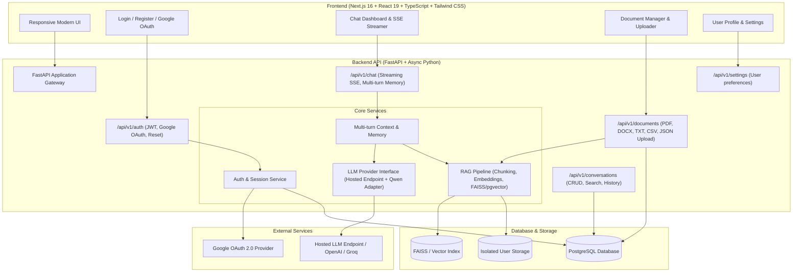

# Phase 3 Architecture & Migration Specification

## 1. Project Overview & Phase 2 Inspection

A thorough inspection of the existing Phase 2 codebase reveals:
* **UI & Presentation**: `app.py` is a monolithic Streamlit application with session state (`st.session_state`), sidebar file uploaders, chat input widgets, Plotly / Matplotlib / Seaborn visualizers, and an X-ray inspection panel (`xray.py`, `visualization.py`).
* **Model Inference**: `model.py` and `chat.py` use Hugging Face Transformers (`AutoModelForCausalLM`, `AutoTokenizer`) loading `Qwen/Qwen2.5-1.5B-Instruct` locally on CUDA/CPU, with streaming handled via PyTorch's `TextIteratorStreamer` in a worker thread.
* **Document Extraction & Chunking**: `document_loader.py` handles PDF (`pypdf`), DOCX (`python-docx`), and plain text. `chunking.py` splits documents with word windows (500 words, 50 overlap) with page-number metadata tracking.
* **Embeddings & Vector Store**: `embeddings.py` generates 384-dimensional dense vectors using `sentence-transformers/all-MiniLM-L6-v2`. `vector_store.py` builds and queries FAISS `IndexFlatIP` (cosine similarity) and serializes metadata to JSON (`chunks.json`, `index.faiss`).
* **RAG Retrieval**: `rag.py` computes query embeddings, finds top-k chunks, applies relevance filtering, builds grounded prompts, and formats source citations.
* **Storage & Persistence**: `database.py` manages local SQLite tables (`conversations` and `messages`), message ordering, feedback, and sources JSON. `memory.py` synchronizes SQLite with `st.session_state`.

---

## 2. Reusability Analysis (Phase 2 -> Phase 3)

| Component | Status | Reusability Plan |
| :--- | :--- | :--- |
| **Document Loaders** (`document_loader.py`) | **Reusable** | Text extraction logic for PDF (`pypdf`), DOCX (`docx`), and TXT can be integrated into the FastAPI document service. We will add structured handlers for CSV and JSON tabular parsing. |
| **Chunking Engine** (`chunking.py`) | **Reusable** | Sliding word window and page-span preservation logic is modular and can be reused as a backend service utility. |
| **Embedding Engine** (`embeddings.py`) | **Reusable** | Dense vector generation using `sentence-transformers/all-MiniLM-L6-v2` can be directly embedded in the backend embedding worker. |
| **FAISS Vector Index** (`vector_store.py`) | **Reusable / Adaptable** | FAISS `IndexFlatIP` cosine search logic and index persistence can be reused per user/workspace, with optional future migration to PostgreSQL `pgvector`. |
| **RAG Prompt Synthesis** (`rag.py`) | **Reusable** | Prompt construction (`build_rag_prompt`), context excerpt formatting, and source citation structure can be ported cleanly into the chat completion pipeline. |
| **Data Models** (`database.py`) | **Reference Schema** | Field definitions (`title`, `role`, `content`, `message_order`, `feedback`, `sources_json`) will serve as the baseline for SQLAlchemy PostgreSQL models. |
| **Qwen Model Engine** (`model.py`, `chat.py`) | **Preserved Adapter** | Per strict instructions, the Qwen model is **not changed or deleted**. It is preserved as a local fallback adapter while designing the primary interface for hosted LLM endpoints. |

---

## 3. Replacement Analysis (Incompatibilities with Phase 3)

| Phase 2 Component | Issue in Multi-User Web Production | Phase 3 Replacement |
| :--- | :--- | :--- |
| **Streamlit UI** (`app.py`, `st.session_state`) | Single-threaded, page-rerun script lifecycle; cannot handle multi-user routing, mobile responsiveness, or JWT/OAuth authentication. | **Next.js (App Router, React, TypeScript, Tailwind CSS)** with modular component architecture. |
| **SQLite DB** (`database.py`) | Single-file, synchronous locking; lacks multi-tenant row isolation, concurrent write scaling, and enterprise query performance. | **PostgreSQL** with **asyncpg** + **SQLAlchemy 2.0 (Async)** and **Alembic** migrations. |
| **In-Memory Session** (`memory.py`) | Coupled to Streamlit server process memory. Cannot scale horizontally. | **Stateless JWT session authentication** with user-scoped PostgreSQL conversation queries. |
| **Local PyTorch Inference** (`model.py`) | High CPU/GPU RAM overhead, slow TTFT on commodity servers, blocks web workers during multi-user concurrent requests. | **Hosted LLM API Endpoint** (OpenAI-compatible / Groq / Hugging Face / vLLM) with Server-Sent Events (SSE) streaming. |
| **File Storage** (`data/documents/`) | Unscoped shared directory on local disk. | **Per-user isolated document directory** with metadata tracked in PostgreSQL. |
| **Security & Auth** | Non-existent in Phase 2. | **Argon2 / bcrypt password hashing**, **JWT access tokens**, **Google OAuth 2.0**, and protected route guards. |

---

## 4. Phase 3 System Architecture



---

## 5. Database Schema Design (PostgreSQL)

```sql
-- 1. Users Table
CREATE TABLE users (
    id UUID PRIMARY KEY DEFAULT gen_random_uuid(),
    email VARCHAR(255) UNIQUE NOT NULL,
    hashed_password VARCHAR(255),
    full_name VARCHAR(255),
    avatar_url TEXT,
    is_active BOOLEAN DEFAULT TRUE,
    is_verified BOOLEAN DEFAULT FALSE,
    created_at TIMESTAMP WITH TIME ZONE DEFAULT CURRENT_TIMESTAMP,
    updated_at TIMESTAMP WITH TIME ZONE DEFAULT CURRENT_TIMESTAMP
);

-- 2. OAuth Accounts Table
CREATE TABLE oauth_accounts (
    id UUID PRIMARY KEY DEFAULT gen_random_uuid(),
    user_id UUID NOT NULL REFERENCES users(id) ON DELETE CASCADE,
    provider VARCHAR(50) NOT NULL, -- 'google'
    provider_user_id VARCHAR(255) NOT NULL,
    access_token TEXT,
    refresh_token TEXT,
    expires_at TIMESTAMP WITH TIME ZONE,
    created_at TIMESTAMP WITH TIME ZONE DEFAULT CURRENT_TIMESTAMP,
    UNIQUE(provider, provider_user_id)
);

-- 3. Conversations Table
CREATE TABLE conversations (
    id UUID PRIMARY KEY DEFAULT gen_random_uuid(),
    user_id UUID NOT NULL REFERENCES users(id) ON DELETE CASCADE,
    title VARCHAR(255) NOT NULL DEFAULT 'New Chat',
    system_prompt TEXT,
    created_at TIMESTAMP WITH TIME ZONE DEFAULT CURRENT_TIMESTAMP,
    updated_at TIMESTAMP WITH TIME ZONE DEFAULT CURRENT_TIMESTAMP
);
CREATE INDEX idx_conversations_user_id ON conversations(user_id);

-- 4. Messages Table
CREATE TABLE messages (
    id UUID PRIMARY KEY DEFAULT gen_random_uuid(),
    conversation_id UUID NOT NULL REFERENCES conversations(id) ON DELETE CASCADE,
    role VARCHAR(50) NOT NULL, -- 'user', 'assistant', 'system'
    content TEXT NOT NULL,
    message_order INTEGER NOT NULL,
    feedback VARCHAR(20), -- 'like', 'dislike', NULL
    sources_json JSONB, -- list of citation objects {filename, page, excerpt, score}
    created_at TIMESTAMP WITH TIME ZONE DEFAULT CURRENT_TIMESTAMP
);
CREATE INDEX idx_messages_conversation_id ON messages(conversation_id);

-- 5. Documents Table
CREATE TABLE documents (
    id UUID PRIMARY KEY DEFAULT gen_random_uuid(),
    user_id UUID NOT NULL REFERENCES users(id) ON DELETE CASCADE,
    filename VARCHAR(255) NOT NULL,
    filepath TEXT NOT NULL,
    file_type VARCHAR(50) NOT NULL, -- 'PDF', 'DOCX', 'TXT', 'CSV', 'JSON'
    file_size_bytes BIGINT NOT NULL,
    num_pages INTEGER DEFAULT 1,
    chunk_count INTEGER DEFAULT 0,
    status VARCHAR(50) DEFAULT 'processed',
    created_at TIMESTAMP WITH TIME ZONE DEFAULT CURRENT_TIMESTAMP
);
CREATE INDEX idx_documents_user_id ON documents(user_id);
```

---

## 6. Directory Structure Implemented for Phase 3

```
phase3/
├── backend/
│   ├── requirements.txt           # FastAPI, SQLAlchemy, asyncpg, JWT, RAG dependencies
│   ├── .env.example               # Database, JWT, OAuth, and Hosted LLM configs
│   └── app/
│       ├── __init__.py
│       ├── api/
│       │   ├── __init__.py
│       │   └── v1/                # Versioned REST endpoints (auth, chat, convs, docs)
│       │       └── __init__.py
│       ├── core/                  # App configuration, security, JWT helpers
│       │   └── __init__.py
│       ├── db/                    # SQLAlchemy engine, session maker, base class
│       │   └── __init__.py
│       ├── models/                # PostgreSQL SQLAlchemy models (User, Conv, Message, Doc)
│       │   └── __init__.py
│       ├── schemas/               # Pydantic request & response validation schemas
│       │   └── __init__.py
│       ├── services/              # Core business services
│       │   ├── __init__.py
│       │   ├── auth/              # JWT, Google OAuth, password hashing
│       │   │   └── __init__.py
│       │   ├── chat/              # Multi-turn conversational memory & context
│       │   │   └── __init__.py
│       │   ├── llm/               # Hosted LLM client + Qwen fallback adapter
│       │   │   └── __init__.py
│       │   └── rag/               # Document loaders, chunking, embeddings, FAISS
│       │       └── __init__.py
│       └── utils/                 # General utility helpers
│           └── __init__.py
│
├── frontend/                      # Next.js 16 + React 19 + TypeScript + Tailwind CSS
│   ├── package.json
│   ├── tsconfig.json
│   ├── next.config.ts
│   ├── .env.example               # Backend API base URL, Google OAuth client ID
│   └── src/
│       ├── app/                   # App Router pages and layouts
│       ├── components/
│       │   ├── auth/              # Login, register, OAuth button components
│       │   ├── chat/              # Message list, input, markdown renderer, controls
│       │   ├── documents/         # Multi-format upload modal, citation panel
│       │   ├── settings/          # User profile and model settings
│       │   └── ui/                # Modern UI primitives
│       ├── hooks/                 # Custom React hooks (chat, auth, streaming)
│       ├── lib/                   # API client, token management, constants
│       └── types/                 # Shared TypeScript interfaces
│
├── [Phase 2 files preserved intact] # app.py, model.py, database.py, rag.py, etc.
└── PHASE3_ARCHITECTURE.md         # This specification document
```
